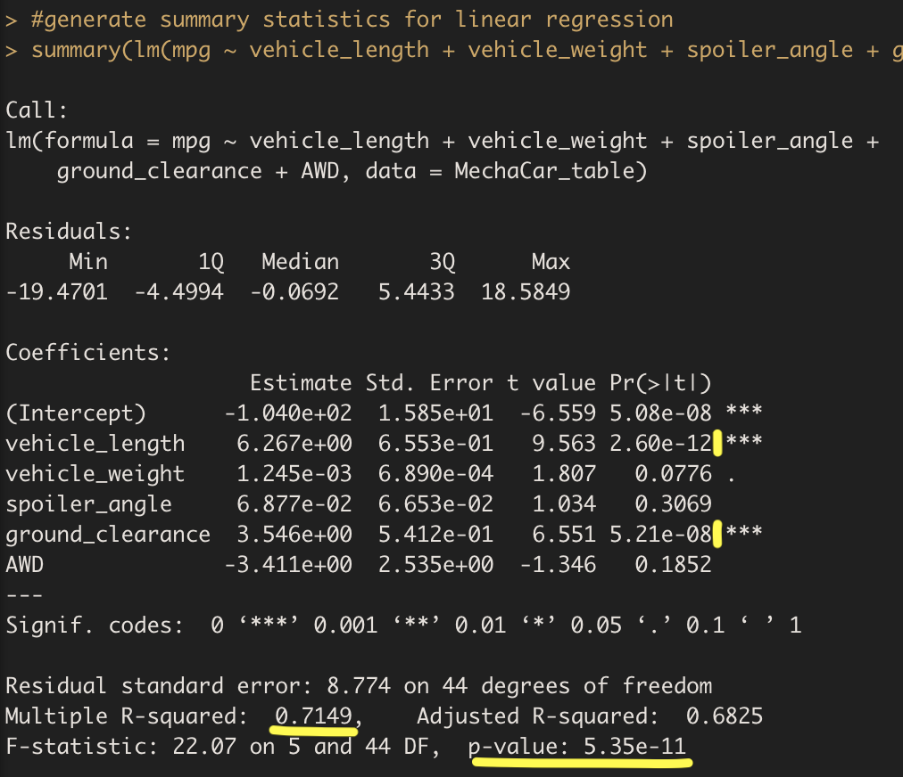

# **MechaCar_Statistical_Analysis**
- Statistical Analysis on automotive data using R. 
- MechaCar_MPG and Suspension_Coil datasets were provided.
## **Linear Regression to Predict MPG**
- sdfdf
- </img>
-
-
-
## **Summary Statistics on Suspension Coils**
- sdfdsf
- </img>
-
- </img>
-
-
-
## **T-Tests on Suspension Coils**
- sdfsdf
- </img>
-
- </img>
- 
- </img>
- 
- </img>
-
-
-
## **Study Design : MechaCar vs Competition**
-
-
-
---
---